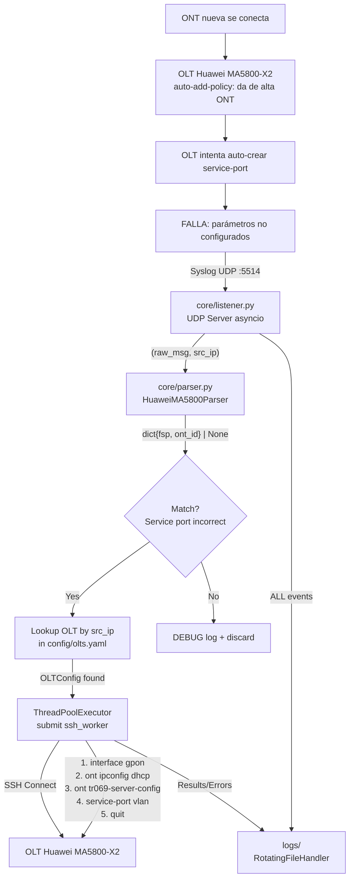
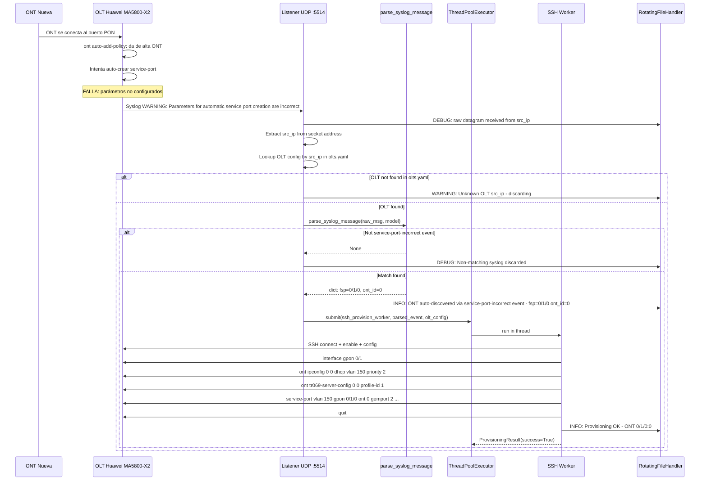

# OLT Auto-Provision Daemon — Architecture Plan

## 1. Visión General

El **OLT Auto-Provision Daemon** es un servicio Linux pasivo (Zero-Touch) que escucha traps Syslog de OLTs Huawei MA5800 en el puerto UDP 514/5514. El mecanismo de disparo se basa en un evento indirecto pero determinista del ciclo de vida de auto-descubrimiento de la OLT:

1. Una ONT nueva se conecta físicamente al puerto PON.
2. La OLT la detecta y, gracias a la directiva `ont auto-add-policy`, la da de alta automáticamente con sus Line Profiles y Service Profiles.
3. Inmediatamente después del auto-add, la OLT intenta crear un **service-port automático**. Como esta funcionalidad **no está configurada a propósito** (queremos que el daemon lo haga de forma controlada), la OLT emite un syslog de WARNING:
   ```
   EVENT NAME :Parameters for automatic service port creation are incorrect
   ```
4. Este evento contiene el **ONT ID definitivo** asignado por la OLT (FrameID, SlotID, PortID, ONT ID).
5. El daemon captura este syslog, extrae los parámetros, y dispara un worker SSH para crear el service-port correcto + WAN de gestión DHCP + perfil TR-069.

**¿Por qué este evento y no "ONT online"?** Porque el evento de "service port incorrecta" ocurre exactamente después del auto-add y contiene el ONT ID asignado. Es el momento preciso para intervenir: la ONT ya existe en la OLT, solo falta la capa de servicio.



## 2. Estructura del Repositorio

```
olt-autoprovision-daemon/
├── config/
│   └── olts.yaml              # Multi-OLT credentials & per-OLT profiles
├── core/
│   ├── __init__.py
│   ├── listener.py             # asyncio UDP syslog server
│   ├── parser.py               # Regex parser strategy (parametrizable by OLT model)
│   └── ssh_worker.py           # SSH provisioning worker (refactored from legacy)
├── logs/                       # Rotating log files (auto-created)
├── deploy/
│   └── olt-provision.service   # systemd unit template
├── main.py                     # Application entry point
└── requirements.txt            # Python dependencies
```

## 3. Diseño Detallado por Componente

### 3.1 `config/olts.yaml` — Configuración Multi-OLT

**Formato YAML-First**: cada OLT se indexa por su IP (clave del diccionario). Los perfiles de provisioning son específicos por OLT, con fallbacks a defaults globales definidos en la sección `defaults`.

```yaml
# config/olts.yaml
defaults:
  syslog_port: 5514             # Puerto UDP de escucha (514 requiere root)
  ssh_port: 22
  management_vlan: 150          # VLAN de gestión para WAN DHCP
  gemport: 2                    # GEM Port para service-port de gestión
  traffic_table_up: "7"         # Traffic table inbound
  traffic_table_down: "7"       # Traffic table outbound
  tr069_profile_id: 1           # TR-069 server profile ID
  dhcp_priority: 2              # Prioridad 802.1p para WAN DHCP
  ip_index: 0                   # IP index para ont ipconfig
  cmd_delay: 0.4                # Delay entre comandos (segundos)
  max_retries: 10               # Reintentos por comando ante OLT ocupada
  parser_model: "huawei_ma5800" # Modelo de parser por defecto

olts:
  "10.11.104.2":
    name: "NODO-HORNILLOS"
    ssh_user: "smartoltusr"
    ssh_pass: "6058gef6"
    ssh_port: 22                # Opcional, usa default si no se especifica
    management_vlan: 150        # Opcional, sobrescribe default
    gemport: 2
    traffic_table_up: "7"
    traffic_table_down: "7"
    tr069_profile_id: 1
    parser_model: "huawei_ma5800"

  "10.11.104.5":
    name: "Villa Dolores 2"
    ssh_user: "smartoltusr"
    ssh_pass: "6058gef6"
    tr069_profile_id: 2         # Esta OLT usa profile-id 2
    traffic_table_up: "SMARTOLT-VOIPMNG-10M"  # Soporta nombres o índices
    traffic_table_down: "SMARTOLT-VOIPMNG-10M"
```

**Principio**: cada OLT hereda de `defaults`; cualquier clave definida en la entrada de la OLT sobrescribe el default. Esto permite que 20 OLTs con la misma topología solo necesiten `name`, `ssh_user`, `ssh_pass`; y OLTs atípicas sobrescriban lo que necesiten.

### 3.2 `core/parser.py` — Parser de Syslog Parametrizable

**Evento Syslog real capturado con tcpdump** desde una OLT Huawei MA5800-X2:

```
<132> 2000-02-09 00:06:30-03:00 0.0.0.0 ! RUNNING WARNING 2000-02-09 00:06:29-03:00
  EVENT NAME :Parameters for automatic service port creation are incorrect
  PARAMETERS :FrameID: 0, SlotID: 1, PortID: 0, ONT ID: 0, Cause:  Parameters for automatic service port creation of an ONT are not configured or incorrectly configured
```

**Patrón Strategy**: se define una clase base `BaseSyslogParser` con un método `parse(raw_message: str) -> dict | None`. Cada modelo de OLT implementa su propia subclase con sus regex específicos. El parser retorna un diccionario plano con claves `fsp` y `ont_id`, o `None` si el mensaje no coincide.

**Por qué un diccionario y no un dataclass**: la función `parse_syslog_message()` debe ser simple, sin dependencias de imports, y directamente utilizable por el listener. El dict es el contrato mínimo: `{"fsp": "0/1/0", "ont_id": "0"}`.

```python
# core/parser.py — Tipos y clase base

from abc import ABC, abstractmethod
from typing import ClassVar

class BaseSyslogParser(ABC):
    """Parser abstracto para syslog de OLTs."""

    @abstractmethod
    def parse(self, raw_message: str) -> dict | None:
        """
        Intenta parsear un mensaje syslog.
        
        Returns:
            dict con claves 'fsp' (str: "FrameID/SlotID/PortID") y
            'ont_id' (str) si el mensaje es relevante.
            None si no hace match.
        """
        ...


class HuaweiMA5800Parser(BaseSyslogParser):
    """
    Parser para Huawei MA5800 series.
    
    Trigger: evento "Parameters for automatic service port creation are incorrect".
    Este evento se dispara inmediatamente después del auto-add de una ONT,
    cuando la OLT intenta crear un service-port automático y falla.
    Contiene el ONT ID definitivo asignado por la OLT.
    """

    # Regex compilada con Named Capture Groups.
    # Extrae FrameID, SlotID, PortID por separado y los une como "fsp".
    # Extrae ONT ID como "ont_id".
    PATTERN: ClassVar[str] = (
        r"Parameters\s+for\s+automatic\s+service\s+port\s+creation\s+are\s+incorrect"
        r".*?"
        r"FrameID\s*:\s*(?P<frame>\d+)"
        r"\s*,\s*"
        r"SlotID\s*:\s*(?P<slot>\d+)"
        r"\s*,\s*"
        r"PortID\s*:\s*(?P<port>\d+)"
        r"\s*,\s*"
        r"ONT\s+ID\s*:\s*(?P<ont_id>\d+)"
    )

    def parse(self, raw_message: str) -> dict | None:
        """
        Parsea un mensaje syslog de Huawei MA5800.
        
        Args:
            raw_message: Mensaje syslog crudo (una o múltiples líneas).
        
        Returns:
            dict {"fsp": "0/1/0", "ont_id": "0"} si el evento es relevante.
            None si el mensaje no contiene el evento de service-port incorrecto.
        """
        # Normalizar: colapsar whitespace para que el regex funcione
        # sobre mensajes multi-línea.
        flattened = " ".join(raw_message.split())
        
        match = re.search(self.PATTERN, flattened, re.IGNORECASE | re.DOTALL)
        if not match:
            return None
        
        frame = match.group("frame")
        slot = match.group("slot")
        port = match.group("port")
        ont_id = match.group("ont_id")
        
        return {
            "fsp": f"{frame}/{slot}/{port}",
            "ont_id": ont_id,
        }


# ---------------------------------------------------------------------------
# Registro de parsers por modelo de OLT
# ---------------------------------------------------------------------------
PARSER_REGISTRY: dict[str, type[BaseSyslogParser]] = {
    "huawei_ma5800": HuaweiMA5800Parser,
}


def get_parser(model: str) -> BaseSyslogParser:
    """
    Factoría de parsers. Devuelve la instancia de parser para el modelo de OLT dado.
    
    Args:
        model: Nombre del modelo (ej: "huawei_ma5800").
    
    Returns:
        Instancia concreta de BaseSyslogParser.
    
    Raises:
        ValueError: Si el modelo no está registrado.
    """
    parser_cls = PARSER_REGISTRY.get(model)
    if parser_cls is None:
        raise ValueError(
            f"Unknown parser model: '{model}'. "
            f"Registered models: {list(PARSER_REGISTRY.keys())}"
        )
    return parser_cls()


# ---------------------------------------------------------------------------
# Función de conveniencia (API pública principal)
# ---------------------------------------------------------------------------
def parse_syslog_message(raw_syslog_str: str, model: str = "huawei_ma5800") -> dict | None:
    """
    Parsea un mensaje syslog y extrae los parámetros de ONT si el evento es relevante.
    
    Esta es la función principal que debe usar el listener. Encapsula la factoría
    de parser y el parseo en un solo callable limpio.
    
    Args:
        raw_syslog_str: Mensaje syslog crudo tal como llega por UDP.
        model: Modelo de parser a utilizar (default: "huawei_ma5800").
    
    Returns:
        dict {"fsp": "0/1/0", "ont_id": "0"} si el evento es de service-port incorrecto.
        None si el mensaje no es relevante.
    
    Example:
        >>> msg = "EVENT NAME :Parameters for automatic service port creation are incorrect ..."
        >>> result = parse_syslog_message(msg)
        >>> print(result)
        {'fsp': '0/1/0', 'ont_id': '0'}
    """
    parser = get_parser(model)
    return parser.parse(raw_syslog_str)
```

### 3.3 `core/listener.py` — Servidor UDP Asíncrono

**Stack de concurrencia**:
- `asyncio` para el bucle de eventos UDP (no bloqueante, alta throughput).
- `concurrent.futures.ThreadPoolExecutor` para workers SSH (Netmiko es síncrono/bloqueante).
- El listener NUNCA bloquea: recibe, parsea, y despacha al thread pool.

```python
class SyslogListener:
    """Servidor UDP asíncrono para recepción de syslog."""
    
    def __init__(
        self,
        host: str = "0.0.0.0",
        port: int = 5514,
        config: OLTConfigManager,
        max_workers: int = 50,       # Máximo de SSH workers concurrentes
    ):
        self.host = host
        self.port = port
        self.config = config
        self.executor = ThreadPoolExecutor(max_workers=max_workers)
    
    async def start(self) -> None:
        """Inicia el bucle de escucha UDP perpetuo."""
        ...
    
    async def _handle_datagram(self, data: bytes, addr: tuple[str, int]) -> None:
        """Callback por cada datagrama recibido."""
        ...
```

**Flujo interno de `_handle_datagram`**:
1. Decodificar `data` (UTF-8, con fallback a Latin-1).
2. Extraer `src_ip` de `addr[0]` — esta es la IP de la OLT, NO del texto del syslog.
3. Buscar OLT en `olts.yaml` por `src_ip` → obtener `OLTConfig` (con credenciales y `parser_model`).
4. Si no se encuentra la OLT → WARN log + discard.
5. Ejecutar `parse_syslog_message(raw_message, model=olt_config.parser_model)` → `dict | None`.
6. Si `None` → DEBUG log + discard (el syslog no es del tipo que nos interesa).
7. Si `dict` con `fsp` y `ont_id` → INFO log + `self.executor.submit(ssh_provision_worker, parsed_event, olt_config)`.
8. El futuro del executor se registra con un callback para loguear éxito/error.

### 3.4 `core/ssh_worker.py` — Worker SSH Refactorizado

**Reciclaje del legacy**: se extraen y encapsulan las siguientes funciones probadas de [`consultas-legacy/omci.py`](consultas-legacy/omci.py) y [`consultas-legacy/ssh_client.py`](consultas-legacy/ssh_client.py):

| Función Legacy | Destino en ssh_worker.py | Propósito |
|---|---|---|
| `connect_olt()` | `HuaweiSSHClient.connect()` | Conexión Netmiko |
| `close_olt()` | `HuaweiSSHClient.disconnect()` | Cierre de sesión |
| `validate_omci_output()` | `HuaweiSSHClient._send_command()` | Ejecución con retry/busy/paging |
| `_read_command_with_paging()` | Integrado en `_send_command()` | Manejo de paginación |
| `_ensure_huawei_config_mode()` | `HuaweiSSHClient.enter_config_mode()` | Entrada a modo config |
| `execute_command()` | `HuaweiSSHClient.execute()` | Log + execute centralizado |
| `BUSY_PATTERNS` | `HuaweiSSHClient.BUSY_PATTERNS` | Constantes de clase |

**Nueva clase principal**:

```python
class ProvisioningWorker:
    """
    Worker SSH para aprovisionar una ONT detectada vía syslog.
    
    El disparador es el evento "Parameters for automatic service port creation
    are incorrect", que ocurre justo después de que el auto-add-policy de la OLT
    da de alta la ONT. La ONT YA existe; solo falta crear service-port + TR-069.
    
    Flujo (3 pasos, sin ont add):
    1. Crear WAN DHCP en VLAN de gestión
    2. Inyectar perfil TR-069
    3. Crear service-port para VLAN de gestión
    """
    
    def provision(
        self,
        parsed_event: dict,        # {"fsp": "0/1/0", "ont_id": "0"}
        olt_config: OLTConfig,     # Configuración YAML de la OLT
    ) -> ProvisioningResult:
        ...
```

**Comandos generados** (basados en el formato del legacy, parametrizados desde YAML):

```python
def _build_commands(self, fsp: str, ont_id: str, cfg: OLTConfig) -> list[str]:
    """
    Construye la secuencia de comandos VRP para provisioning.
    
    Args:
        fsp: Frame/Slot/Port en formato "0/1/0".
        ont_id: ONT ID asignado por la OLT.
        cfg: Configuración YAML de la OLT con perfiles.
    """
    frame, slot, port = fsp.split("/")
    
    return [
        # 1. Entrar a interfaz GPON
        f"interface gpon {frame}/{slot}",
        
        # 2. WAN DHCP en VLAN de gestión
        f"ont ipconfig {port} {ont_id} ip-index {cfg.ip_index} dhcp "
        f"vlan {cfg.management_vlan} priority {cfg.dhcp_priority}",
        
        # 3. Perfil TR-069
        f"ont tr069-server-config {port} {ont_id} profile-id {cfg.tr069_profile_id}",
        
        # 4. Service-port para VLAN de gestión
        f"service-port vlan {cfg.management_vlan} gpon {frame}/{slot}/{port} "
        f"ont {ont_id} gemport {cfg.gemport} multi-service "
        f"user-vlan {cfg.management_vlan} tag-transform translate "
        f"inbound traffic-table index {cfg.traffic_table_up} "
        f"outbound traffic-table index {cfg.traffic_table_down}",
        
        # 5. Salir de GPON
        "quit",
    ]
```

**Manejo de errores**:
- `netmiko.exceptions.NetmikoTimeoutException` → `ConnectionError`
- `netmiko.exceptions.NetmikoAuthenticationException` → `AuthenticationError`
- `OSError` / `socket.error` → `ConnectionError`
- Errores funcionales de la OLT (output contiene "Failure", "Error") → `OLTCommandError`
- OLT ocupada → reintento automático (hasta `max_retries`, con backoff exponencial)
- Timeout SSH → desconexión limpia + log CRITICAL

### 3.5 `main.py` — Punto de Entrada

```python
"""
OLT Auto-Provision Daemon — Entry Point.

Usage:
    python main.py                        # Uses defaults (UDP :5514, config/olts.yaml)
    python main.py --port 514             # Privileged port (requires root)
    python main.py --config /etc/olt/olts.yaml
"""

def main():
    args = parse_args()
    setup_logging(args.log_dir)
    config = load_olt_config(args.config_path)
    listener = SyslogListener(
        host=args.host,
        port=args.port,
        config=config,
        max_workers=args.max_workers,
    )
    logger.info(f"Starting OLT Auto-Provision Daemon on UDP :{args.port}")
    asyncio.run(listener.start())
```

### 3.6 Sistema de Logs

- **Librería**: `logging` estándar de Python.
- **Handlers**:
  - `StreamHandler(sys.stdout)` → consola (nivel INFO).
  - `RotatingFileHandler("logs/daemon.log", maxBytes=10*1024*1024, backupCount=5)` → archivo rotativo.
- **Formato**: `%(asctime)s [%(levelname)s] %(name)s: %(message)s`
- **Niveles por tipo de evento**:
  - `DEBUG`: Syslog recibido pero no matchea (no es "service port incorrect").
  - `INFO`: Evento de service-port-incorrect detectado, inicio/fin de SSH worker, éxito.
  - `WARNING`: OLT no encontrada en YAML, reintentos por OLT ocupada.
  - `ERROR`: Fallo de conexión SSH, fallo de comando, timeout.
  - `CRITICAL`: Error irrecuperable del listener (socket bind fail).

### 3.7 `deploy/olt-provision.service` — Systemd Unit

```ini
[Unit]
Description=OLT Auto-Provision Daemon (Zero-Touch GPON)
After=network-online.target
Wants=network-online.target

[Service]
Type=simple
User=olt-daemon
Group=olt-daemon
WorkingDirectory=/opt/olt-autoprovision-daemon
ExecStart=/opt/olt-autoprovision-daemon/venv/bin/python main.py
Restart=always
RestartSec=10
StandardOutput=journal
StandardError=journal
SyslogIdentifier=olt-provision

# Security hardening
NoNewPrivileges=yes
ProtectSystem=strict
ProtectHome=yes
ReadWritePaths=/opt/olt-autoprovision-daemon/logs
AmbientCapabilities=CAP_NET_BIND_SERVICE

[Install]
WantedBy=multi-user.target
```

## 4. Diagrama de Secuencia



## 5. Mapeo de Reciclaje: Legacy → Nuevo

| Archivo Legacy | Funciones/Clases Recicladas | Archivo Destino | Notas |
|---|---|---|---|
| [`ssh_client.py`](consultas-legacy/ssh_client.py) | `connect_olt()`, `close_olt()` | [`core/ssh_worker.py`](core/ssh_worker.py) → `HuaweiSSHClient` | Envuelto en clase con context manager |
| [`omci.py`](consultas-legacy/omci.py) | `validate_omci_output()`, `BUSY_PATTERNS`, `_read_command_with_paging()` | [`core/ssh_worker.py`](core/ssh_worker.py) → `HuaweiSSHClient._send_command()` | Lógica de retry/busy/paging intacta |
| [`omci.py`](consultas-legacy/omci.py) | `execute_command()` | [`core/ssh_worker.py`](core/ssh_worker.py) → `HuaweiSSHClient.execute()` | Centraliza log+exec |
| [`huawei_injection.py`](consultas-legacy/huawei_injection.py) | `_ensure_huawei_config_mode()` | [`core/ssh_worker.py`](core/ssh_worker.py) → `HuaweiSSHClient.enter_config_mode()` | Verificación de prompt + enable + config |
| [`config.py`](consultas-legacy/config.py) | `OLT_COMMANDS` (templates de comandos) | Adaptados en [`core/ssh_worker.py`](core/ssh_worker.py) → `_build_commands()` | Parametrizados desde YAML, no hardcodeados |
| [`config.py`](consultas-legacy/config.py) | `_parse_ont_mode_profiles()` | NO se recicla | La lógica de perfiles por modelo ONT no aplica (ont auto-add-policy lo maneja) |

**Lo que NO se migra** (fuera del alcance del daemon):
- GUI (`gui.py`, `*_ui.py`)
- CSV parsing (`csv_logic.py`)
- SmartOLT API (`smartolt_api.py`)
- MikroTik API (`mikrotik_secret_ui.py`)
- Soporte ZTE / TP-Link (solo Huawei MA5800 en esta fase; extensible por diseño)
- Migración BDCOM (`migration_bdcom.py`)
- `.env` (reemplazado por `olts.yaml`)

## 6. Dependencias (`requirements.txt`)

```
netmiko>=4.3.0          # SSH client for Huawei VRP
pyyaml>=6.0             # YAML config parsing
```

**Cero dependencias externas adicionales.** El resto se cubre con la librería estándar de Python 3.11+:
- `asyncio` — UDP server
- `logging` + `logging.handlers.RotatingFileHandler` — logs
- `concurrent.futures.ThreadPoolExecutor` — workers SSH
- `dataclasses` — tipos de datos
- `re` — regex
- `argparse` — CLI

## 7. Consideraciones de Diseño SOLID

| Principio | Aplicación |
|---|---|
| **S**ingle Responsibility | `listener.py` solo recibe UDP, `parser.py` solo parsea, `ssh_worker.py` solo ejecuta SSH |
| **O**pen/Closed | `PARSER_REGISTRY` + `BaseSyslogParser` permiten agregar nuevos modelos de OLT (ZTE, Nokia) sin modificar código existente |
| **L**iskov Substitution | Cualquier subclase de `BaseSyslogParser` debe ser intercambiable: mismo contrato `parse() -> dict | None` |
| **I**nterface Segregation | Interfaces pequeñas: `parse()`, `provision()`, `connect()`, `execute()` |
| **D**ependency Inversion | `listener.py` depende de `parse_syslog_message()` (función) y `OLTConfig` (dataclass), no de implementaciones concretas de parser |

## 8. Próximos Pasos (Fuera del Alcance Inicial)

1. Health check endpoint HTTP (`/health`, `/metrics`) para monitoreo Prometheus.
2. Soporte para OLTs ZTE C600/C620 (parser + worker).
3. Webhook de notificación (Slack/Telegram) en caso de fallo.
4. **Deduplicación de eventos**: si la OLT envía el mismo warning múltiples veces para la misma ONT, evitar reprovisionar. Implementar un cache TTL en memoria (ej: `{(src_ip, fsp, ont_id): timestamp}`) con expiración de 5 minutos.
5. Tests unitarios con `pytest` + `pytest-asyncio` para listener y parser.
6. Soporte para syslog sobre TCP (algunas OLTs solo envían por TCP 514).

## 9. Resumen del Contrato del Parser

El parser expone una única función pública simple que el listener invoca:

```python
# Firma oficial
def parse_syslog_message(raw_syslog_str: str, model: str = "huawei_ma5800") -> dict | None:
    ...

# Entrada (ejemplo real)
raw = '''
<132> 2000-02-09 00:06:30-03:00 0.0.0.0 ! RUNNING WARNING 2000-02-09 00:06:29-03:00
  EVENT NAME :Parameters for automatic service port creation are incorrect
  PARAMETERS :FrameID: 0, SlotID: 1, PortID: 0, ONT ID: 0, Cause:  Parameters for automatic service port creation of an ONT are not configured or incorrectly configured
'''

# Salida
result = parse_syslog_message(raw)
# result == {"fsp": "0/1/0", "ont_id": "0"}

# No match
result = parse_syslog_message("Some unrelated syslog message")
# result is None
```
